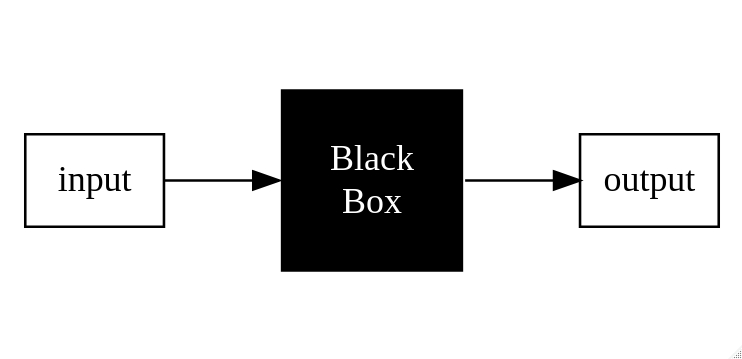

```{r setup, include=FALSE}
knitr::opts_chunk$set(echo = TRUE)
```

[Return to Tutorial Menu](https://auqmer.github.io/TutoR/)

This tutorial  will introduce you to principles of programming that I hope will help you to understand the logic of statistical programming languages in general, and how they are implemented in R.

### What's the difference between a **Statistical Program** and a **Statistical Programming Language**?

**Statistical Programs** |  **Statistical Programming Languages** |
-------------------------|----------------------------------------|
 work on data spreadsheets | work on a variety of object types
 are procedural (like fast food) | are interactive (like fine dining)
 often limited to developers procedures | allow you to create custom functions
 are often developed to make getting output easy | require you to know what you are doing

### Advantages of Programming

* Flexibility
* Reproducibility
* Saves you time!!

## The Elements of Programming

1. **Primitive expressions** - which represent the simplest elements of a language
2. **Means of combination** - by which compound objects are created from primitive or other expressions
3. **Means of abstraction** - by which compound elements can be named and manipulated

## 1. Primitive Expressions

* Represent the simplest entities in a programming language
* Think of them as the individual lego blocks
* Primitive expressions have a few basic *types*

### Basic Types of Expressions

* **Numeric** -integers (1,2), real number (1.2, -3.1, 200.0), and maybe imaginary numbers
* **String** - "Hello world!", "Ten", 'Cat', "This is a sentence, which is made up of strings", "10" ( in single or double quotes)
* **Boolean** - TRUE or FALSE (use operators such as *or*, *and* and *not*)

## 2. Combining Expressions

Primitive expressions can be combined:

If you type the following combined *expression*

```
1 + 2
```
the programming language will *evaluate* it and print

```
3
```

## Objects and Environments

## 3. Functions: A Primary Means of Abstraction 

* Functions are used to abstract compound expressions
* Functions take inputs, process them and result in outputs



