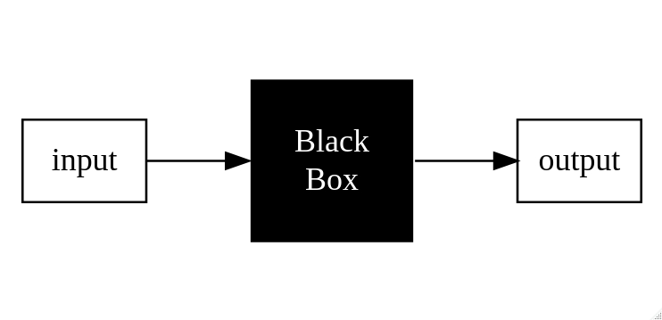

```{r setup, include=FALSE}
knitr::opts_chunk$set(echo = TRUE, comment = NULL)
```

[Return to Tutorial Menu](https://auqmer.github.io/TutoR/)

This tutorial introduces principles of programming that I hope will help you to understand the logic of statistical programming languages in general, and how they are implemented in R.
It consists of three sections.
First, I argue why we need statistical programming, and identify some of the benefits.
Second, I outline the elements of statistical programming, with the hope that this helps organize your learning.
Third, I offer suggestions and provide links to resources to help you begin learning the R statistical programming language, and argue for how statistics should be taught using such an language.

## Statistical Rituals versus Statistical Reasoning

### Why Do We Need Statistical Programming?

A statistical programming language (SPL) is a domain-specific programming language that was developed specifically to do statistical work.
Examples include R and Julia.
In this article, I will expand that definition to include general purpose languages that have extensive statistical procedures developed. 
The most popular example in this category is Python. 

####  What's the difference between a **Statistical Program** and a **Statistical Programming Language**?

Statistical programs, such as SPSS, Minitab, or Stata, are developed to make statistical analysis convenient for users, often by insulating them from the computer coding.
These programs also often insulate users from other decisions needed to conduct statistical analyses.
Most utilize a menu-based interface that allows users to point and click through selections of procedures, selecting options along the way.
Table 1 compares stati


#### **Table 1**

#### *Comparing Statistical Programs to Statistical Programming Languages*

**Statistical Programs** |  **Statistical Programming Languages** 
-------------------------|----------------------------------------
 spreadsheet oriented   | object-oriented (many data types) 
 are procedural          | are interactive 
 often limited to developers procedures | allow users to create custom functions 
 are often developed to make getting output easy | require you to understand what you are doing 

Menu based programs make creativity difficult. There are several barriers to developing novel ideas. 
SPLs are much more amenable to supporting creative problem solving.

As researchers begin working with real data on real problems, adaptation of what they learned in their statistics courses is inevitable. 
Real data tends to violate assumptions, and often does not behave as well as the tidy examples used to demonstrate statistical methods.
Menu based programs force the researcher to adapt their questions and data to fit the prepackaged methods.
With an SLP, researchers can adapt the software to fit their needs.

### Statistical Programming Languages Promote Reproducibility


### Statistical Rituals versus Statistical Reasoning


### Teaching with SLPs

* You can demonstrate the logic of the procedures and equations. 
* The language provides a formal logic to the methods.
* Good statistical programming includes creating scripts, which should include not only the computer code but also comments that describe why the code was used. This helps students record their reasoning during an analysis, both their goals and conclusions.


### Advantages of Programming

* Flexibility
* Transparency
* Reproducibility
* Saves you time!!

#### Flexibility

Menu based software is inherently limited. 
There are only so many procedures that can be put in a menu before it gets unwieldy.
This often forces researchers to fit their needs into the framework of the software.
With a statistical programming language, the software is flexible enough that it can be adapted to your needs, and not the other way around.

#### Transparency

Menu based software also make it very difficult to understand what is going on under the hood with many of the procedures.
The procedures are black boxes.
Statistical programming languages also use black box abstraction, which is very valuable, but these languages give the option of looking under the hood at the algorithms underlying the analysis.
They also make it possible to implement novel algorithms or procedures not already included in the software. 
This means that newer methods will most likely appear in software based on statistical programming languages first.

#### Reproducibility

Menu based software can be useful when you are doing things that you will only do once, and the means of obtaining your results are not important. 
Neither of those is applicable with most of what we do in statistics: We run our methods multiple times, and how we get our results are critical to interpreting the results.
This is particularly important as there is now a big push to make our research reproducible.
There are ways to do that with most menu based statistical software, but if you are creating code, it makes sense to reap the full benefit of a statistical programming language.

### Statistical Rituals versus Statistical Reasoning

#### Calculation versus Problem Solving

Much of math education focuses on teaching students to do calculations.

This leads students to learn math as a ritual instead of a means to solve problems. 
This happens in graduate statistics courses as well. 
We often cover more content than is reasonable to build an intuitive understanding. 
Without an intuitive understanding of statistical concepts, students are left with memorizing the sequence of procedures needed to obtain the output from software.
Menu based statistical programs make these procedures easy.
But at the expense of further distancing the students from the underlying concepts.

#### Steps of mathematics (Conrad Wolfram)

1. Pose the right question
2. Formulate the question mathematically/programmatically
3. Calculate the answer (mathematically)
4. Interpret the (mathematical) answer for the real world

#### Oracles versus Golems

## Elements of Statistical Programming

### The Elements of Programming

1. **Primitive expressions** are the simplest elements of a language, and include *primitive functions* and *primitive data*.
2. **Means of combination** of primitive or other expressions to create compound expressions.
3. **Means of abstraction** which allow compound objects to be named and manipulated.

#### 1. Primitive Expressions

* Represent the simplest entities in a programming language
* Think of them as the basic building blocks of everything else in language
* Primitive expressions have a few basic *data types*
* Programming languages also have primitive functions built in

An **expression** is an input that the programming language can evaluate.
For example, if the number 3 is entered into R, it will evaluate it as a number and return that number.

```{r }
3
```

So, the numeral `3` is an primitive expression (as are all numerals).
But if I enter something like this:

```{r , eval=FALSE}
three
```

```
Error: object 'three' not found
```
I get an error message because this is not a valid R expression.
The word `three` is not a primitive expression. 

##### Primitive Data Types

SPLs have multiple basic data types, and the number and definition varies across language. Here I focus on the three most universal data types, which are also the most useful to those learning to use programming languages.

* **Numeric** - integers (1,2), real number (1.2, -3.1, 200.0), and maybe imaginary numbers.
* **Character** or **String** - "Hello world!", "Ten", 'Cat', "This is a sentence, which is a string", "10" ( in single or double quotes)
* **Boolean** or **Logical** - TRUE or FALSE (use operators such as *or*, *and* and *not*)


#### 2. Combining Expressions

Primitive expressions can be combined in various ways.
If you type the following combined *expression*

```
1 + 2
```
R will *evaluate* it and print

```
[1] 3
```

But, if I enter:

```{r, eval=FALSE}
3 4 5
```

I get the error message:
```
Error: unexpected numeric constant in "3 4"
```
because I have not combined the three primitive expressions in a way that is recognized by the language.
The following are some of the most common ways to combine expressions in R.

##### Binary Operators 

A very simple but useful way to combine expressions is through arithmetic calculations.
In the example above we added `1 + 2` and got `3` as we would expect.
R can use all the basic math operators you would expect.

#### **Table 2**

#### *Arithmetic Operators*

Operator | Description
---------|---------
+        | Addition
- | Subtraction
* | Multiplication
/ | Division
^ | Exponentiation
%% | Modulus (the remainder from division)
%/% | Integer Division

#### **Table 3**

#### *Relational and Logical Operators*

Operator | Description
---------|-------------
<  | Less than
`>`  | Greater than
<= | Less than or equal to
`>=` | Greater than or equal to
== | Equal to
!= | Not equal to
!  | Not
`|` | Or
&  | And

##### Functions for Combining Expressions

The `c()` function concatenates or combines expressions into a vector.
For example, 

```{r}

```


There are multiple functions in R to combine 

## Functional Abstraction

#### 3. Functions: A Primary Means of Abstraction 

* Functions are used to abstract compound expressions
* Functions take inputs, process them and result in outputs



## Data Abstraction

From vectors to lists, matrices and arrays

## Functional Abstraction

### Hierarchical Functional Abstraction and Levels of Organization

Functional abstraction enables dealing with conceptual and prodecural complexity.


## Objects and Environments

Include convenience functions such as:

* with
* within
* transform

x <- c(red="Huey", blue="Dewey", green="Louie")

y = c(first = 1, second = 2, third = 3)
y


### Caution 

While SPLs offer the potential for better research, they also require more effort to learn. 

Just using a SPL is not sufficient to confer all the advantages described at the beginning of this tutorial.
They must be used in particular ways.

They also offer potential for teaching statistics. 
But, if we teach with SPL in the same way as we teach with program, little will improve.
We have to use the SPL to teach statistical reasoning, not just code based rituals.

A SPL formalizes the logic of statistics.
But to be effective, teachers must teach statistics with a language in a way the makes this logic intuitive. 
Furthermore, teachers must teach the limitations of this logic, and there are limitations. 
Statistical logic and the statistical models they represent, necessarily  over-simplify our reality. 
That is not so much a limitation but the goal.