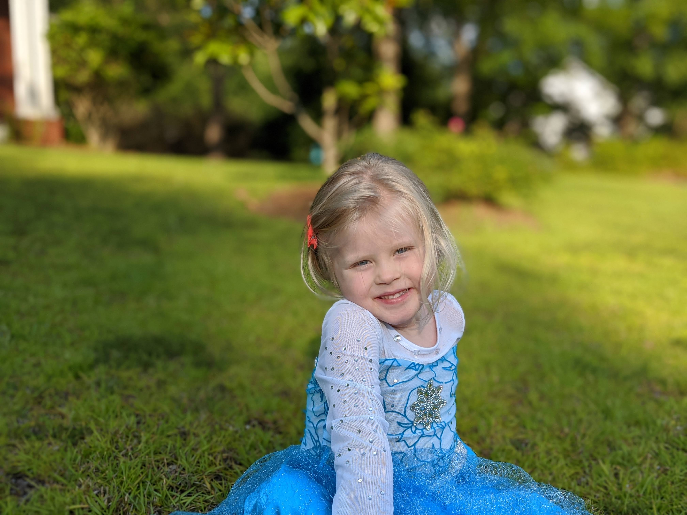
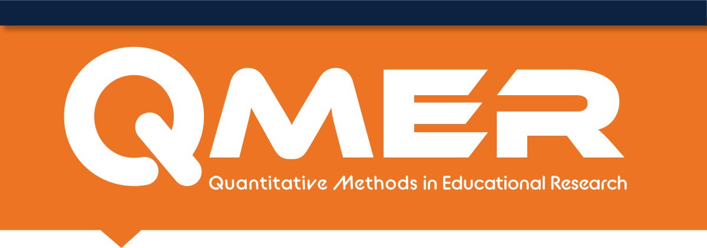

```{r setup, include=FALSE}
library(knitr)
opts_chunk$set(echo = FALSE)
options(htmltools.dir.version = FALSE)
```

## Overview

* a little about me
* Using Nationally Representative Longitudinal Data
* QMER Learning Community
* Time to answer your questions

---
## A little about me

* Ph.D. in Educational Psychology, *University of Virginia* 2010

Research Interests:

* **Cognition and Learning**
    - How do we learn to reason?
    - What are the roles of spatial and visuomotor skills in STEM learning?
    - Cognitive bias in STEM reasoning
  
* **Complex Modeling**
    - Causal Modeling, particularly mechanistics/process modeling
    - Longitudinal Modeling: Intraindividual processes, Intensive LM 
    - Hierarchical Modeling
  
* **Statistical Programming and Reproducible Research**
   - There is a *Replication Crisis* in most fields of science
   - Its related to Null Hypothesis Statistical Testing (NHST) - which is a lot of what I teach!!
   - Modeling is another (I think better) way to do research.
    
???

* Cog and Learning
    + Thought I wanted to be Clinical psychologist
    + no grad school, M.Ed. "don't like people"
    + by chance into grad school
    
* Complex Modeling
    + Realist: all live in same complex reality
    + Too complicated to comprehend, so left to build models of reality
    + all unique; based on our experiences, values, goals and contexts in society
    + nice balance between two extremes: (objective understanding of reality and relativism)

* Stat prog
    + Replication crisis?
    + Not only questioning outcomes of research but also research process
    + Lot of ideas about what to do
    + Me: better theory development (causal thinking/modeling), better measurement (ILM, biomarkers, real-time process models)
    
---
class: inverse middle center

```{r, out.width="70%"}

```


---
class: inverse middle center

## Secondary Data Analysis

### Using Nationally Representative Longitudinal Data for Research

---
## Internal Validity vs. External Validity

--
* **Internal Validity** - whether we can make causal attributions to the relations betwen variables.
    * Does **A** cause **B**.
    * Threatened by *Third Variables*
    
--

* **External Validity** - extent to which a relation holds over variation in persons, settings, treatments, and outcomes.
    * Will my findings apply to other settings?
    * Hinges on whether the sample is representative of the population of interest (do the characteristics of the sample reflect the characteristics of the population?)

---
## Public vs Private Schools and Academic Achievement

* Should I send Rosalind to private school?
* RQ: Do private schools promote achievement better than public schools?

---
## Public vs Private Schools and Academic Achievement

--
* **Study 1 - local school study:**
    * 20 local schools (half public, half private)
    * Compare average achievement test scores by school type
--
* **Study 2 - U.S. school study:**
    * 20 schools randomly sampled from the U.S. (some public, some private)
    * Compare average achievement test scores by school type 
--
* **Study 3 - Charter school study:**
  * 20 local charter schools
  * Over-prescribed
  * Randomly assign applicants to be admitted.
  * Others go to public school
  * Collect scores on all that **applied**
  * Compare average achievement test scores by school type

---
## Internal Validity vs. External Validity

--
 | Low External | High External
 ---|--
 **Low Internal** | Local | U.S.
 **High Internal** | Charter| ??
 
 
--
*  **It is really difficult to conduct studies high in both Internal and External Validity**
* So we usually pick one to emphasize
* Both are hard to do (particularly when you are a graduate student!)

--


**SECONDARY DATA ANALYSIS CAN BE A VIABLE OPTION FOR DISSERTATION AND OTHER RESEARCH!!**

---
## A Potential Solution: Using Existing Data

* Often referred to as *secondary data analysis*
* Our government collects extensive educational data
* This brings me to QMER...

---
class: inverse middle


---
## QMER Strands and Operations

* Theory, Measurement, and Methodological Forum
* Learning Community
* Local Data Center


---
## Theory, Measurement, and Methodological Forum

--

.large[
* **Active research on improving quantitative methods**
    + Student and faculty collaborations
    + Publications from housed data
]
--
.large[
* **Dissemination of research and techniques to local stakeholders, policymakers, and educational practitioners**
    + Catalog Canvas Course on best practice
    + Consultations with state and local education agencies
]

---
## Learning Community

--
.large[
* **Host monthly round tables to support and improve research in progress**
]
--
.large[
* **Provide workshops on advanced techniques**
    * Offer micro credentials in methods
]
--
.large[
* **Support and engage diverse body of students in quantitative research**
]
--
.large[
* **Utilize continuous improvement model to increase program effectiveness**
    * Collect data for program development and future research
]


---
## Local Data Center

--
.large[
* **Host server to house local and national data**
    * Collect, clean, and upload local data sources
    * Maintain access to publicly available NCES data
]
--
.large[
* **Maintain open access to data**
    * Train researcher to use data
    * Provide gateway to curated data sets
]
--
.large[
* **Provide resources for computation and survey management**
    * Host client for statistical computation (Franklin)
    * Annual survey of Alabama educators distribution and storage
]

---
## NCES Data Sets

* National
    * National Assessment of Educational Progress (NAEP)
    * National Assessment of Adult Literacy (MAAL)

* International
    + International Activities Program

* Early Childhood
    + [**Early Childhood Longitudinal Study**](https://nces.ed.gov/ecls/)
    + National Household Education Survey

* Postsecondary
    + Baccalaureate and Beyond (B&B)
    + Beginning Postsecondary Students Longitudinal Study (BPS)
    + Career/Technical Education Statistics (CTE Statistics)
    + **High school and Beyond** (HS&B)
    * **Integrated Postsecondary Education Data System** (IPEDS)
    * **National LongitudinalStudy of the H.S. Class of 1972** (NLS-72)
    * (more)